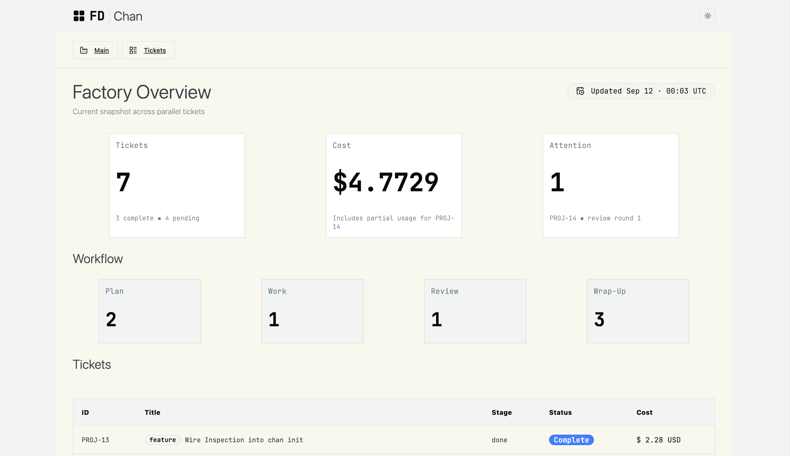
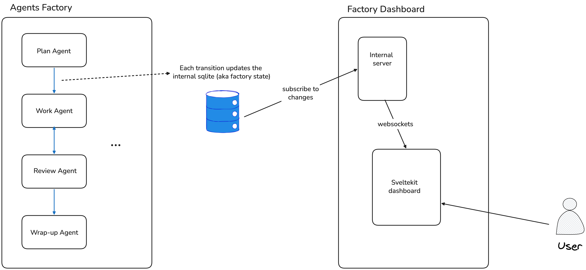

# Factory Dashboard

A custom factory agents dashboard to visualize activity|blockers, ticket progress, and token usage.


**WIP - The project is in active development**



## Who this is for

This dashboard is planned to be used as an external accessory of GEUT's factory. You can see more [here](https://github.com/geut/sbx-shell-pi) and [here](https://github.com/geut/factory-skills). 

## Stack

The stack is mostly: Svelte with SvelteKit, shadcn-svelte, tailwindcss, TS,d TanStack table and others. 

There will be an external (local) server used to read and watch (observe) the factory sqlite db. We will probably connect it with the dashboard via websockets to have some instant updates. 



## Development

We are using `pnpm`.

### Install

```bash
pnpm i
```

### Run local server

```bash
pnpm run dev
```