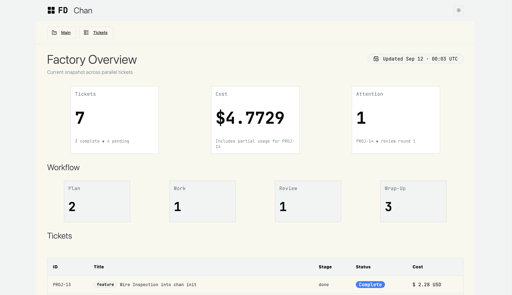
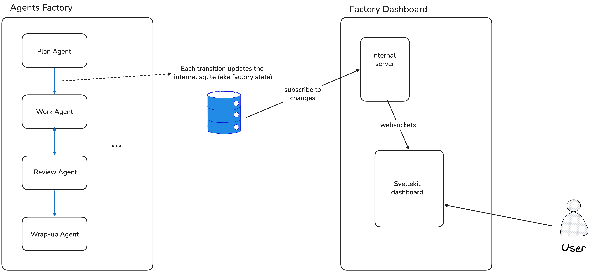

# Factory Dashboard

A custom factory agents dashboard to visualize activity, attention requests, ticket progress, and token usage.

**WIP - The project is in active development**



## Who this is for

This dashboard is planned to be used as an external accessory of GEUT's factory. You can see more [here](https://github.com/geut/sbx-shell-pi) and [here](https://github.com/geut/factory-skills). How it will be shipped into a factory sandbox is described in [sbx-shell-pi kit integration](#sbx-shell-pi-kit-integration-in-progress).

## Stack

The stack is mostly: Svelte with SvelteKit, shadcn-svelte, tailwindcss, TS,d TanStack table and others.

There will be an external (local) server used to read and watch (observe) the factory sqlite db. We will probably connect it with the dashboard via websockets to have some instant updates.



## sbx-shell-pi kit integration (in progress)

> **Status: in progress** — the mixin kit is not published yet. Everything below is the planned shape of the integration; track it in [sbx-shell-pi PR #6](https://github.com/geut/sbx-shell-pi/pull/6).

[sbx-shell-pi](https://github.com/geut/sbx-shell-pi) is migrating its sandbox images to **kits** (v3 sandbox kits: `pi`, `pi-docker`, `factory`). Kits compose: a **mixin** kit adds a capability to a workload kit instead of shipping yet another full image.

This dashboard is planned to be published as one of those mixins — tentatively `ghcr.io/geut/sbx-kit-factory-dashboard` (name and version are not final). It will require `node >= 24` and `pi-factory >= 1`. Only the sbx-shell-pi `factory` workload provides those names, so the mixin composes only onto that kit and cannot be installed on the single-pi kits.

Once composed:

- **Herdr stays the entrypoint.** The mixin does not replace or wrap the terminal workflow.
- The dashboard runs beside Herdr and reads the project's `.factory/db/state.sqlite` — the same read-only observation described in [PRODUCT.md](./PRODUCT.md). The terminal remains the control path.

Planned usage, once the mixin is published:

```bash
sbx run --name factory ghcr.io/geut/sbx-shell-pi:node-24-factory /path/to/project \
  --kit ghcr.io/geut/sbx-kit-factory-dashboard:0.1.0
```

The `0.1.0` tag is tentative. The mixin set is fixed when the sandbox is created, so changing it means creating a new sandbox.

## Development

We are using `pnpm`.

### Install

```bash
pnpm i
```

### Run local server

```bash
pnpm run dev
```

### Development data

The dashboard reads a factory controller state database (state schema version 2) **read-only**, named by
the runtime `DB_URL` environment variable (`/abs/path` or `file:/abs/path`). There are two ways to get one
to develop against:

1. **A real database** from a factory run: point `DB_URL` at `<project>/.factory/db/state.sqlite` of any
   project driven by [factory-skills](https://github.com/geut/factory-skills).

   ```bash
   DB_URL=/absolute/path/to/<project>/.factory/db/state.sqlite pnpm run dev
   ```

2. **A scratch database** built from the vendored reference schema (`test/fixtures/state-schema.sql`, a
   provenance-stamped copy of the controller's `schema.sql` — see its header and ADR 0004). This yields an
   empty but valid v2 database; tests populate scratch copies the same way via `test/scratch-db.ts` and
   `test/seed.ts`.

   ```bash
   node -e "
     const { DatabaseSync } = require('node:sqlite');
     const { readFileSync } = require('node:fs');
     const db = new DatabaseSync('/tmp/scratch-state.sqlite');
     db.exec(readFileSync('test/fixtures/state-schema.sql', 'utf8'));
     db.close();
   "
   DB_URL=/tmp/scratch-state.sqlite pnpm run dev
   ```

A missing database, or one whose `schema_meta.schema_version` is not 2, renders a readable error page
instead of serving stale or wrong data. Nothing in this repo ever writes to factory state.

